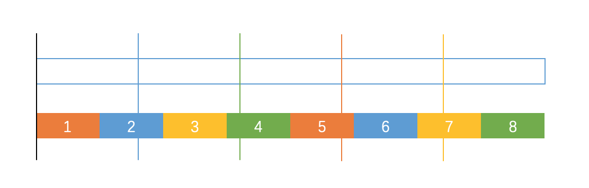
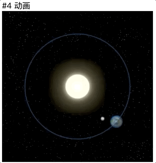

## canvas太阳系动画实现中的细节

太阳系动画是MDN中Canvas的一个基础动画示例，可以从中。[MDN链接](https://developer.mozilla.org/zh-CN/docs/Web/API/Canvas_API/Tutorial/Basic_animations)

示例实现的效果是这样：

<div align=center></div>

canvas动画的实现可以分成两个部分：更新画布的方法，和绘制每一帧的方法。

- 更新画布的方法通常采用`window.requestAnimationFrame()`来设定定期执行一个指定函数。
- 绘制每一帧通常包括了以下几步：1. 清空上一帧的内容；2. 绘制图形内容

#### 一、更新画布的方法：`window.requestAnimationFrame()`
使用方法：接受一个回调函数作为参数，并在浏览器下一次重绘之前执行该回调函数。回调函数会被传入`DOMHighResTimeStamp`参数。`DOMHighResTimeStamp`参数是一个用于存储时间值的双精度浮点值，是浏览器提供的表示回调函数被调用时的时间戳（相对值），误差小于1毫秒。

特点：回调函数执行次数与浏览器屏幕刷新次数相匹配，运行在后台标签页或者隐藏的\<iframe\>里时，`requestAnimationFrame()` 会被暂停调用以提升性能和电池寿命。

**为什么好于`setInterval()`？**

-  一般情况下浏览器的刷新频率是60Hz即每秒60次。每次刷新的间隔为16ms左右。当`setInterval()`间隔设置为10ms时，假设从0ms开始计算。
<div align=center></div>
上面一行是屏幕刷新的时刻，下面一行是`setInterval()`图像刷新的时刻。可以看到很多次图像的输出结果并没有显示在屏幕上。一方面可能会造成动画的掉帧，另一方面会浪费计算资源。

- 那有人可能会问，如果我把`setInterval()`间隔设置为16ms(此时帧率为60fps)是不是能完全解决这个问题呢？考虑以下这种情况：一个HTML5游戏通常按照60fps帧率设计动画参数，若计算过于复杂或运行设备算力低下导致每一帧需要的计算时间超过16ms，会发生什么？游戏动画会变慢，如果运算一帧的时间为33ms，那么游戏中运动物体的速度会是预计的一半。可能30fps的动画仍然流畅，但视觉效果会与原本设想的完全不同。要解决这个问题，`setInterval()`实现动画时，必须要再通过一个参数记录运行时真实的时间间隔，通过这个参数再运算出刷新画面数据时目标正确的位置。显然这样很不优雅，因为这个时间间隔的长短和动画逻辑是没有直接关系的。而为此设计的api`requestAnimationFrame()`可以很好地把时间间隔与画面刷新组织起来。

#### 二、绘制每一帧的方法

主要流程：

* 清空画布
* 画太阳
* 画地球、地球阴影
* 画月球
* 画地球轨道

1. 清空画布：
一般可以直接将整个画布或者某一个矩形区域用`ctx.clearRect `清空。如果背景复杂，为了不必要的重新绘制可以将`<canvas>`分层。如果需要拖影等效果可以在清空画布时通过`fillRect`方法设置透明度，具体可见[长尾效果](https://developer.mozilla.org/zh-CN/docs/Web/API/Canvas_API/Tutorial/Advanced_animations#%E9%95%BF%E5%B0%BE%E6%95%88%E6%9E%9C)

2. 画太阳：太阳是通过图片绘制的。把坐标系移到画布中心后可直接绘制，绘制图片的方法是`ctx.drawImage `,具体见[使用图片](https://developer.mozilla.org/zh-CN/docs/Web/API/Canvas_API/Tutorial/Using_images)。
3. 地球和地球阴影，地球和地球阴影都绕太阳做圆周运动，圆本质是离一固定点相等长度的点的集合。此时坐标系原点已经位于画布中心也就是太阳所在之处，地球的实时位置可以分解为先将画布旋转某特定角度，再往此时x轴方向上偏移固定长度。固定长度可以根据设计的比例自己决定，但旋转的角度如何确定呢。考虑以下几种方法：

	* 直接由实时时间戳（绝对毫秒数）进行计算
	* 由绘制回调函数传入的时间戳进行计算
	* 由绘制时刻的时/分/秒/毫秒数值进行计算

	理论上三种方法效果相同，因为角度是以360度为周期循环的，但实际实现上效果差异很大。`Date.now()`返回的实时时间戳约为1559492580000+，将这个数字传入`ctx.rotate`方法计算角度会导致动画直接卡住。第二种方法的时间戳是从0开始累积的，不可避免地会累积到一个比较大的数字，当时间戳到达10^8数量级时动画帧率明显降低，而10^8毫秒只不过是一两天而已。
	
	所以比较好的方法是通过`Date`对象的方法取当前时间的时刻值，比如10时39分40秒234毫秒，既能满足循环计算位置的要求，也不会积累产生大数量级的数字导致计算效率下降。每分/秒/毫秒对应的旋转角则根据周期长短进行设定和计算。

4. 月球的画法与地球类似，旋转中心变为了地球。
5. 画地球轨道，地球轨道是一个圆弧，直接用`ctx.arc`方法就能画，但是问题在于：此时坐标系已经不知道变换了几次，如何使坐标系（和其他相关参数）快速返回到画太阳时的状态呢？答案是通过`ctx.save()`和`ctx.restore()`方法。
> 	save 和 restore 方法是用来保存和恢复 canvas 状态的，都没有参数。Canvas 的状态就是当前画面应用的所有样式和变形的一个快照。
> 	Canvas状态存储在栈中，每当save()方法被调用后，当前的状态就被推送到栈中保存。一个绘画状态包括：
> 	
> 	当前应用的变形（即移动，旋转和缩放）
> 	strokeStyle, fillStyle, globalAlpha, lineWidth, lineCap, lineJoin, miterLimit, shadowOffsetX, shadowOffsetY, shadowBlur, shadowColor, globalCompositeOperation 的值
> 	当前的裁切路径（clipping path）
> 	你可以调用任意多次 save 方法。
> 	
> 	每一次调用 restore 方法，上一个保存的状态就从栈中弹出，所有设定都恢复。


MDN示例代码如下：
>
>```js
>	var sun = new Image();
>	var moon = new Image();
>	var earth = new Image();
>	function init(){
>	  sun.src = 'https://mdn.mozillademos.org/files/1456/Canvas_sun.png';
>	  moon.src = 'https://mdn.mozillademos.org/files/1443/Canvas_moon.png';
>	  earth.src = 'https://mdn.mozillademos.org/files/1429/Canvas_earth.png';
>	  window.requestAnimationFrame(draw);
>	}
>	function draw() {
>	  var ctx = document.getElementById('canvas').getContext('2d');
>
>	  ctx.globalCompositeOperation = 'destination-over';
>	  ctx.clearRect(0,0,300,300); // clear canvas
>	
>	  ctx.fillStyle = 'rgba(0,0,0,0.4)';
>	  ctx.strokeStyle = 'rgba(0,153,255,0.4)';
>	  ctx.save();
>	  ctx.translate(150,150);
>	  // Earth
>	  var time = new Date();
>	  ctx.rotate( ((2*Math.PI)/60)*time.getSeconds() + ((2*Math.PI)/60000)*time.getMilliseconds() );
>	  ctx.translate(105,0);
>	  ctx.fillRect(0,-12,50,24); // Shadow
>	  ctx.drawImage(earth,-12,-12);
>	  // Moon
>	  ctx.save();
>	  ctx.rotate( ((2*Math.PI)/6)*time.getSeconds() + ((2*Math.PI)/6000)*time.getMilliseconds() );
>	  ctx.translate(0,28.5);
>	  ctx.drawImage(moon,-3.5,-3.5);
>
>	  ctx.restore();
>	  ctx.restore();
>	  ctx.beginPath();
>	  ctx.arc(150,150,105,0,Math.PI*2,false); // Earth orbit
>	  ctx.stroke();
>	 
>	  ctx.drawImage(sun,0,0,300,300);
>	  window.requestAnimationFrame(draw);
>	}
>	init();
>```

但是这段代码的实现效果有一个问题(见文章开始的动图): 
**地球没有自转**!!!!!

在绘制地球的前需要添加一行代码：

```js
    ctx.save();
    ctx.rotate(((2 * Math.PI) / 1) * time.getSeconds() + ((2 * Math.PI) / 1000) * time.getMilliseconds());
    ctx.drawImage(earth, -12, -12);
    ctx.restore();
```
最后实现效果如下：

<div align=center></div>

